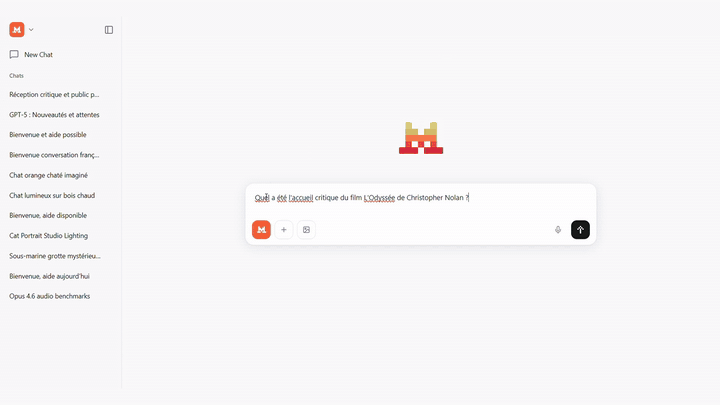

# Le Chat Local

> Assistant IA 100 % local inspiré du Chat de Mistral AI : chat, voix, génération d'images et recherche web. Aucune donnée ne quitte la machine.

<p align="center">
  
</p>

<p align="center">
  <em>Recherche web sourcée, génération d'image contextuelle et vision, le tout en local.</em>
</p>

Le Chat Local est une application de bureau qui orchestre plusieurs services d'IA tournant en local sur votre machine : un LLM via Ollama, la synthèse et la reconnaissance vocale via des sidecars Python, la génération d'images via Stable Diffusion Forge, et la recherche web via une instance SearXNG auto-hébergée. L'application démarre et arrête elle-même ces services.

---

## Fonctionnalités

- **Chat LLM en streaming** — API native Ollama (`/api/chat`), avec paramètres réglables : `temperature`, `num_ctx`, `num_predict`, `keep_alive`.
- **Persistance des conversations** — base SQLite, sidebar de navigation, titrage automatique de la conversation après le premier échange.
- **Vision** — envoi d'images au modèle (encodées en base64 dans le champ `images` de la requête Ollama).
- **Synthèse vocale (TTS)** — Kokoro ONNX, avec détection automatique de la langue (français / anglais) via `whatlang`.
- **Reconnaissance vocale (STT)** — faster-whisper `large-v3-turbo`, accélération CUDA et filtrage VAD.
- **Génération d'images** — Stable Diffusion Forge, avec *VRAM swap* orchestré : décharge le LLM → génère l'image → décharge le checkpoint SD → recharge le LLM. Le prompt est d'abord raffiné par le LLM en tenant compte du contexte de la conversation (ce qui permet des demandes du type « refais une image similaire mais la nuit »).
- **Recherche web RAG** — pipeline *Retrieve-Read-Rank* maison (`src-tauri/src/web/`) branché sur SearXNG : expansion en plusieurs requêtes, extraction du contenu principal des pages, scoring lexical + sémantique, puis génération d'une réponse sourcée.
- **Démarrage automatique des services** — Ollama, Docker Desktop et SD Forge sont lancés par l'application s'ils ne tournent pas déjà, et arrêtés proprement à la fermeture.

---

## Architecture

```
Le Chat/
├── src/                          # Frontend Next.js (export statique)
│   ├── app/                      # App router
│   ├── components/
│   │   ├── chat/                 # ChatContainer, InputBar, Message
│   │   ├── layout/               # Sidebar
│   │   └── icons/
│   ├── stores/                   # Zustand : chatStore, conversationStore, sdForgeStore
│   ├── hooks/
│   └── lib/                      # types, constantes
│
├── src-tauri/                    # Backend Rust
│   ├── src/
│   │   ├── lib.rs                # Setup, orchestration au démarrage, cleanup à la fermeture
│   │   ├── commands/
│   │   │   ├── llm.rs            # stream_chat, preload/unload model, ensure_ollama_running
│   │   │   ├── image_gen.rs      # Pipeline VRAM swap + appel SD Forge
│   │   │   ├── sd_forge.rs       # Cycle de vie du process SD Forge
│   │   │   ├── tts.rs            # Sidecar Python TTS (JSON-RPC sur stdin/stdout)
│   │   │   ├── stt.rs            # Sidecar Python STT (JSON-RPC sur stdin/stdout)
│   │   │   ├── database.rs       # SQLite : conversations et messages
│   │   │   └── settings.rs       # settings.json
│   │   └── web/                  # Pipeline de recherche RAG
│   │       ├── docker.rs         # Cycle de vie Docker + conteneur SearXNG
│   │       ├── providers.rs      # Client SearXNG
│   │       ├── fetch.rs          # Récupération des pages
│   │       ├── evidence.rs       # Extraction du contenu
│   │       └── rank.rs           # Scoring des résultats
│   ├── capabilities/default.json # Permissions Tauri
│   └── tauri.conf.json
│
├── python-sidecar/src/
│   ├── sidecar_standalone.py     # Sidecar TTS (Kokoro)
│   ├── stt_sidecar.py            # Sidecar STT (faster-whisper)
│   └── tts_engine.py
│
├── services/searxng/             # docker-compose.yml + settings.yml
└── assets/models/                # Modèles TTS (non versionnés)
```

### Point d'architecture important : aucun `fetch` côté WebView

Tous les appels HTTP passent par le backend Rust via `invoke` et le système d'événements Tauri — **jamais** par `fetch` depuis le WebView. En build de production, le WebView bloque les requêtes vers `localhost`, ce qui provoquait des erreurs `Failed to fetch`.

Le streaming du LLM en est l'illustration : la commande Rust `stream_chat` ([llm.rs](src-tauri/src/commands/llm.rs)) consomme le flux Ollama et émet des événements `llm-token-{sessionId}` / `llm-done-{sessionId}`, que le frontend écoute dans `streamLlmResponse` ([chatStore.ts](src/stores/chatStore.ts)).

Toute nouvelle intégration HTTP doit suivre ce modèle.

### Ports utilisés

| Service | Port | Défini dans |
|---|---|---|
| Ollama | `11434` | `src-tauri/src/commands/llm.rs` |
| SD Forge | `7860` | `src-tauri/src/commands/sd_forge.rs`, `image_gen.rs` |
| SearXNG | `8080` | `src-tauri/src/web/docker.rs`, `web/providers.rs` |

---

## Prérequis

### Système

- **Windows 10 / 11** — la gestion des processus est spécifique à Windows (`CREATE_NO_WINDOW`, `taskkill /F /T`). L'application ne fonctionnera pas telle quelle sur macOS ou Linux.
- **GPU NVIDIA avec CUDA** — fortement recommandé : faster-whisper et SD Forge sont configurés pour l'accélération CUDA. Prévoir suffisamment de VRAM pour le LLM (le *VRAM swap* permet de partager la mémoire entre le LLM et Stable Diffusion, mais pas de s'en passer).

### Logiciels

| Logiciel | Usage |
|---|---|
| [Node.js](https://nodejs.org) 20+ | Frontend Next.js |
| [Rust](https://rustup.rs) (stable) | Backend Tauri |
| [Ollama](https://ollama.com) | Inférence LLM |
| [Docker Desktop](https://www.docker.com/products/docker-desktop/) | Conteneur SearXNG |
| Python 3.10+ | Sidecars TTS et STT |
| [SD WebUI Forge Classic](https://github.com/Haoming02/sd-webui-forge-classic) | Génération d'images |

### Environnements Python

Deux environnements **distincts** sont nécessaires (les dépendances CUDA de faster-whisper entrent en conflit avec onnxruntime) :

1. **Environnement principal (TTS)** — dépendances dans `python-sidecar/requirements.txt` : `kokoro-onnx`, `onnxruntime`, `numpy`, `soundfile`.
2. **Environnement `sst-env` (STT)** — `faster-whisper` et CTranslate2 avec support CUDA.

### Modèles à télécharger

| Modèle | Emplacement attendu |
|---|---|
| `kokoro-v1.0.onnx` | `assets/models/` |
| `voices-v1.0.bin` | `assets/models/` |
| Modèle LLM Ollama | géré par Ollama (`ollama pull`) |
| Checkpoint Stable Diffusion `.safetensors` | dossier `models/Stable-diffusion/` de SD Forge |

> Les fichiers `assets/models/*.onnx` et `*.bin` sont exclus du dépôt via `.gitignore` : il faut les télécharger séparément.

---

## Installation

**1. Cloner le dépôt et installer les dépendances Node**

```bash
npm install
```

**2. Créer l'environnement Python pour le TTS**

```bash
pip install -r python-sidecar/requirements.txt
```

**3. Créer l'environnement Python `sst-env` pour le STT**

```bash
conda create -n sst-env python=3.11 -y
```

```bash
conda run -n sst-env pip install faster-whisper
```

**4. Placer les modèles TTS dans `assets/models/`**

**5. Télécharger un modèle LLM**

```bash
ollama pull ministral-3:3b-instruct-2512-q4_K_M
```

**6. Lancer en développement**

```bash
npm run tauri dev
```

**7. Compiler une version distribuable**

```bash
npm run tauri build
```

Les installeurs sont générés dans `src-tauri/target/release/bundle/msi/` et `src-tauri/target/release/bundle/nsis/`.

---

## Données générées

L'application écrit dans le répertoire de données applicatives Tauri, créé au premier lancement. Sur Windows, il s'agit de `%APPDATA%\com.lechat.local\` (le nom du dossier dérive de l'`identifier` défini dans `src-tauri/tauri.conf.json`).

| Fichier | Contenu |
|---|---|
| `conversations.db` | Base SQLite : tables `conversations` et `messages` |
| `settings.json` | Préférences : URL Ollama, modèle, voix, langue, paramètres LLM |

**Schéma de la base :**

- `conversations` — `id`, `title`, `created_at`, `updated_at`
- `messages` — `id`, `conversation_id`, `role`, `content`, `timestamp`, `images` (JSON), `image_gen` (JSON)

Les images envoyées au modèle comme les images générées sont stockées **en base64 directement dans la base**, dans les colonnes JSON `images` et `image_gen`. La base peut donc grossir rapidement avec un usage intensif de la génération d'images.

Aucun cache ni fichier de log n'est écrit sur disque : les logs partent sur `stderr` via `env_logger`, visibles uniquement en mode développement.

Pour repartir de zéro, il suffit de supprimer le dossier `%APPDATA%\com.lechat.local\`.

---

### Limitations

- **Windows uniquement.** Le code de gestion des processus (masquage de console, arbre de processus) est spécifique à Windows.
- **La fenêtre de Docker Desktop s'affiche** lors du démarrage automatique. Docker Desktop force l'affichage de sa fenêtre au lancement et il n'existe pas de contournement fiable. Pour l'éviter, activez « Start Docker Desktop when you sign in » dans les réglages de Docker : il sera déjà lancé au démarrage de l'application.
- **Paramètres de génération d'images figés** — 512×512, 20 steps, sampler `DPM++ 2M Karras`, `cfg_scale` 5, définis en dur dans `src-tauri/src/commands/image_gen.rs` (lignes 43-50). Ils ne sont pas exposés dans l'interface.
---

## Développement

| Commande | Description |
|---|---|
| `npm run dev` | Frontend Next.js seul (port 3000) |
| `npm run build` | Export statique du frontend vers `out/` |
| `npm run tauri dev` | Application complète en mode développement |
| `npm run tauri build` | Build de production + installeurs MSI et NSIS |

**Stack :** Next.js 16 (export statique), React 19, Tailwind CSS 4, Zustand, Framer Motion, react-markdown côté frontend. Tauri 2, rusqlite, reqwest, scraper, whatlang, tokio côté backend.

---
